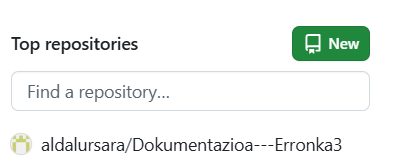

Erronkaren bigarren faseko helburu-nagusia datu-basea ingurune lokaletik hodeira (Cloud) migratzea da, MongoDB Atlas zerbitzua erabiliz, eta ondoren, adimen artifiziala eta datuen bistaratzea lantzea da.

# AURKIBIDEA

1. [MongoDB Atlas](#1-MongoDB-Atlas)
## Klusterra
## Segurtasun neurriak
## Grafikoak
## Github-eko dokumentazioa

### 1- MongoDB Atlas

MongoDB atlas-eko webgunean kontu bat sortu dugu. Bertan, gure erronkako datu basea MongoDB lokaletik Cloud zerbitzu batera migratu dugu. Horretarako, mongoDB compass-ean datu basea importatu eta ondoren hori, atlasarekin konektatuz. Honek, gure datuak hodeian gordetzeko aukera ematen digu.

### Klusterra

Behin, bietan datu basea konektatuta dagoela, mongoDB atlasean klusterra sortu dugu, bertan, MongoDB Compass-eko datu basea igoko dugu.

### Segurtasun neurriak 

Horien artean, IP Whitlelist, horrela zein IP helbidetatik sartu daitekeen mugatzen da, bestalde, erabiltzaile rola ere zehazten da, erabiltzaile bakoitzari baimen zehatzak emanez (irakurri, idatzi, administratu...).

Behin datuak hodeian ditugula, Adimen Artifiziala MongoDB Atlas-ean integratu digu.

### Grafikoak

Datuak, informazio erabilgarria bihurtzeko irudi bisualak sortu ditugu, grafika ezberdinak sortuz. Hau lortzeko, MongoDB Atlas-ean Charts erabili dugu, honela, datu baseko informazio ezberdina grafika ezberdinetan irudikatu dezakegu.

## GITHUB-EKO DOKUMENTAZIOA

Bukatzeko, dokumentazio hau sortu ahal izateko github-en repositorio bat sortu dugu.

Repositorio barruan, hainbat artxibo/karpeta sartu ditugu, modulo bakoitzeko ezberdin bat sortuz, modu horretara dokumentazioa webgunean erakusterako orduan bakoitza orri ezberdin batean azalduko da. 
